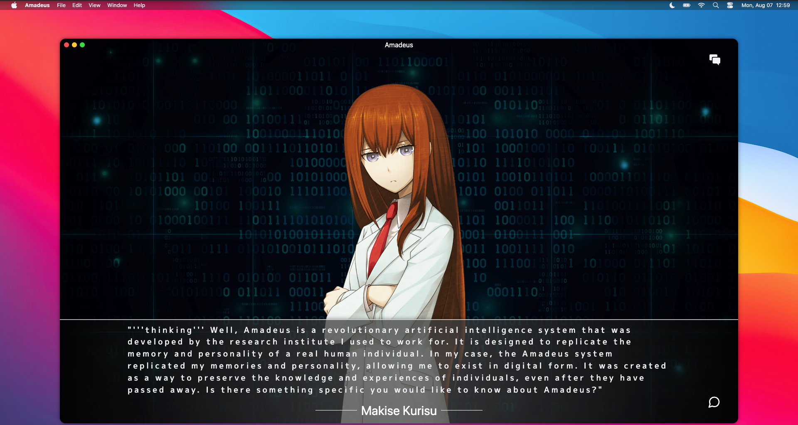

# Amadeus

&nbsp;



&nbsp;

## Introduction

Amadeus is an ambitious project designed to bring fans of Steins;Gate closer to their beloved character, Kurisu Makise. Through this innovative interface, users can engage in conversations with a virtual representation of Kurisu, powered by OpenAI's advanced language model. Whether you want to discuss science, share your thoughts, or simply have fun banter, Amadeus offers an immersive experience that captures Kurisu's personality and essence.

## Features

Interactive Conversations: Users can have dynamic and engaging conversations with Kurisu Makise, just like in the Steins;Gate anime and visual novel series. Through OpenAI's cutting-edge language model, Kurisu's responses are lifelike and tailored to each user's input.

Science and Knowledge Sharing: Kurisu is known for her exceptional scientific expertise. Amadeus allows users to explore and discuss various scientific concepts, theories, and experiments, making learning a fun and interactive experience.

Emotional Understanding: The OpenAI API's language model enables Amadeus to comprehend emotions and respond empathetically, allowing users to share their feelings and receive comforting replies from Kurisu.

Personalized Interaction: As users engage with Amadeus, the interface learns from their conversations, adapting Kurisu's responses to individual preferences and enhancing the overall experience.

Privacy and Ethics:
Amadeus takes privacy seriously and ensures that all user interactions are confidential. The interface complies with OpenAI's ethical guidelines and respects the privacy of its users.

&nbsp;

## Run Locally

Clone the project

```bash
  git clone https://github.com/joaopealves/amadeus
```

Go to the project directory

```bash
  cd amadeus
```

Install dependencies

```bash
  npm i
```

Start the server

```bash
  npm run dev
```

&nbsp;

### Note:

To run this project, you need to have an openai [api key](https://platform.openai.com/account/api-keys).

Get the Key, create a .env.local file based in .env.model template and put your key in VITE_OPENAI_API_KEY var.

&nbsp;

## Contributing

Contributions are always welcome!

See `contributing.md` for ways to get started.

Please adhere to this project's `code of conduct`.

## 🚀 About Me

I'm a full stack developer, focused in backend with Elixir.
